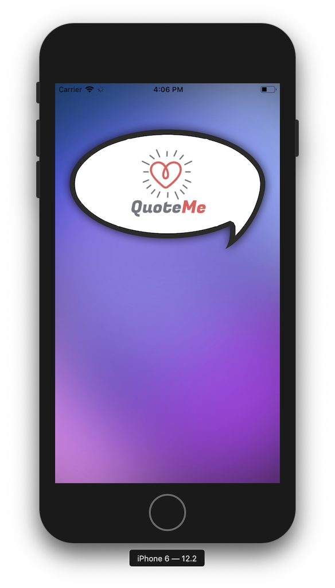
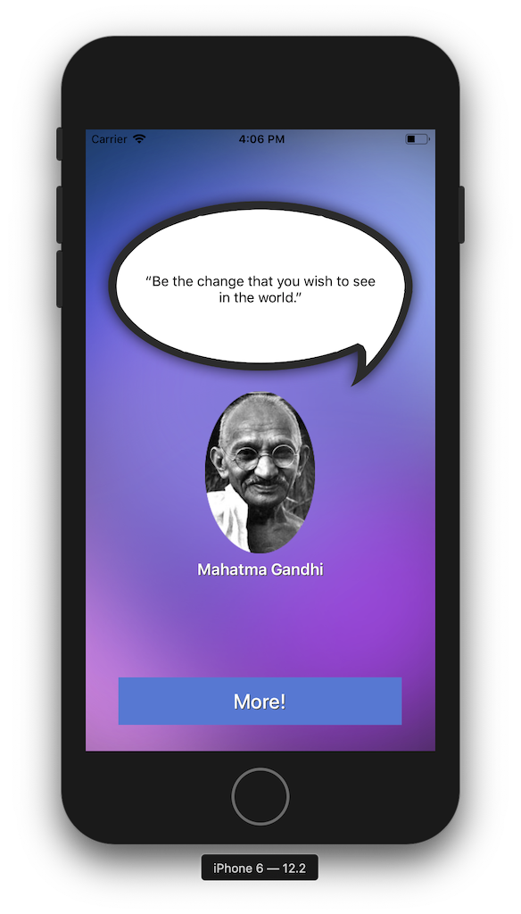
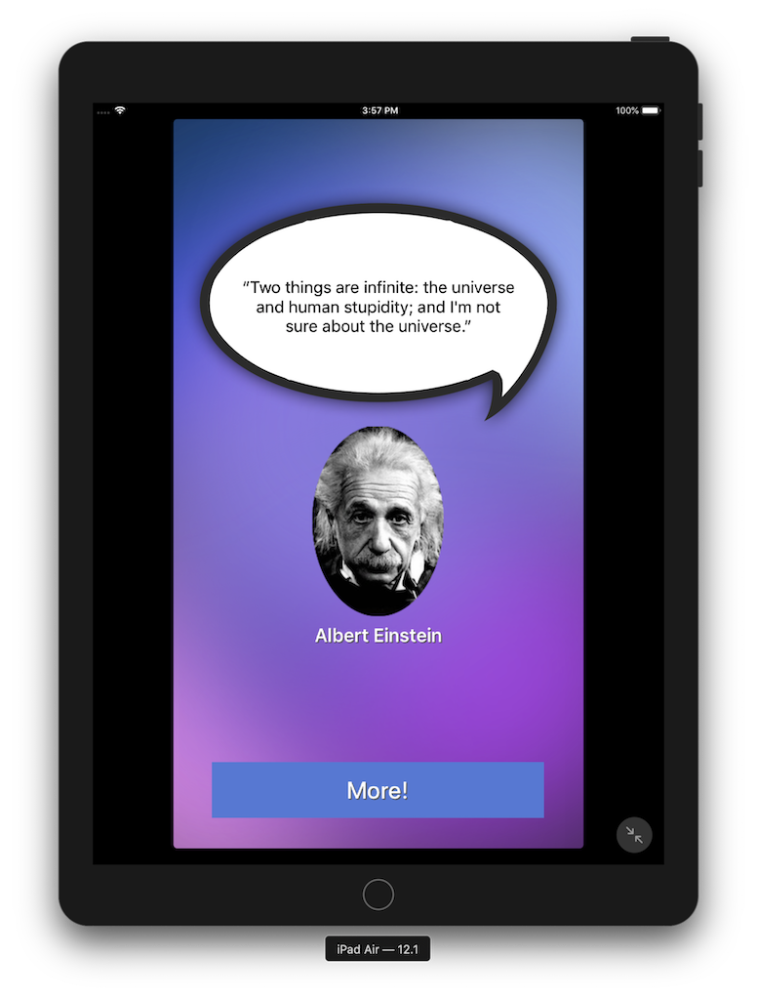

# Assignment #1: Quote App

## Specific concepts exercised in this assignment

* Single View Application
* UIViewController
* UIImageView
* UILabel
* UIButton
* Array
* Functions
* Random number generation

## Assignment requirements

Your Aim is to create a Quotes Application using Xcode for iOS 12 on iPhones and iPads. The purpose of this application is to build an app that displays random Quotes to users using locally prebuilt Quotes data and images. Students are expected to use their imagination in building the app.

## Screenshots of the app running

<a rel="edwaldoalmeida.com" href="https://www.edwaldoalmeida.com">**Edwaldo Almeida**</a> @ 2019
